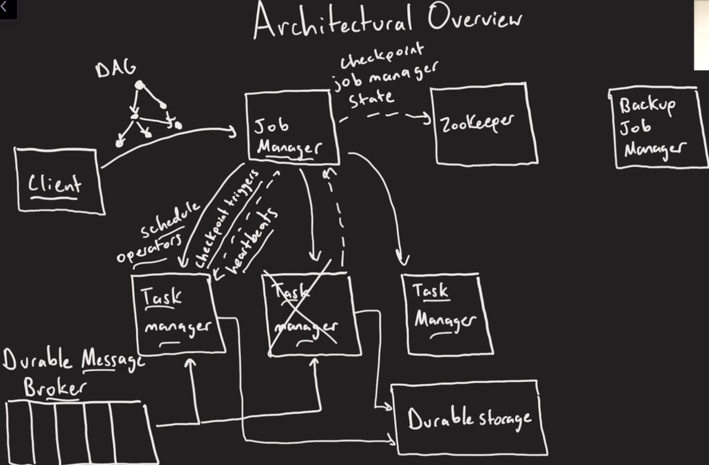

# Apache Flink

In-memory stream processing framework. There's no need to add database to the mix. Recommended for real-time data processing by [a Google SWE](https://youtu.be/DZwnP_qwAlA?si=GMWJpF8A4OHfJW34)

Flink allows you to define a Lambda architecture in a single system. For example, you can use Flink to watch [kafka topic](https://nightlies.apache.org/flink/flink-docs-release-1.20/docs/connectors/datastream/kafka) for new events. You can also use Flink to [watch a folder for new files](https://nightlies.apache.org/flink/flink-docs-release-1.20/docs/connectors/datastream/filesystem/).

## Concepts

- A Stream (bounded or unbounded) is a source of records.
- A Job is a combination of DAG
- A checkpoint is used by job manager to check in the state of the job. Flink uses file system to store the checkpoint.

### Types of Streams

1. Pipelined: 
- Two consecutive map functions on an incoming records.
- Backpressure between consecutive map functions.
- Optional configurable buffer pools to mitigate backpressure. Two main fields: Size Threshold (Larger = More Throughput) and Time Threshold (Smaller = Lower Latency).

2. Blocking Stream: 
- whole thing materialized, possibly to disk

### DataStream API

BATCH Mode: For bounded stream, where the there is a start and end. E.g. Read from a file, or database. 

STREAMING Mode: 
- For unbounded stream, where the there is start but no defined end. E.g. Read from Kafka, Messaging Queue, etc. I
- It is guaranteed that data will be processed "exactly once". 
- Flink job is more event-driven and reactive.

### Consistency

Consistency can be guaranteed by using Checkpointing Mode. There are tradeoffs between consistency and latency.

1. Do you care about losing records? 
- If yes, go to #2
- If no, no checkpointing is needed

2. Do you care about correct results?
- If yes, go to #3
- If no, set CheckpointingMode.AT_LEAST_ONCE & replayable sources

3. Do you care about duplicate (yet correct) records downstream?
- If yes, set CheckpointingMode.EXACTLY_ONCE & replayable sources & transactional sinks
- If no, set CheckpointingMode.EXACTLY_ONCE & non-replayable sources

The more "yes" you answer, the more latency your job will have.

### Availability

> Job Level

Job can be restarted by checkpoint state. Before a job is started, it will checkpoint to a **file system**.
If a job updates/cancels, the next run will resume from the checkpoint.

> Job Manager

There are 2 deployment models that can ensure Job Manager highly available.

1. [Zookeeper HA](https://nightlies.apache.org/flink/flink-docs-release-1.20/docs/deployment/ha/zookeeper_ha/)
2. [Kubernetes HA](https://nightlies.apache.org/flink/flink-docs-release-1.20/docs/deployment/ha/kubernetes_ha/)

Flink can be [natively deployed to Kubernetes](https://nightlies.apache.org/flink/flink-docs-release-1.20/docs/deployment/resource-providers/native_kubernetes/) so it is recommended to use Kubernetes HA. Additionally, Flink also provides [Kubernetes Operator](https://nightlies.apache.org/flink/flink-kubernetes-operator-docs-release-1.11/docs/concepts/overview/) to manage Flink jobs on Kubernetes.

## Apache Zeppelin

Usually goes with Flink for Data Visualization

https://zjffdu.medium.com/flink-on-zeppelin-part-1-get-started-2591aaa6aa47